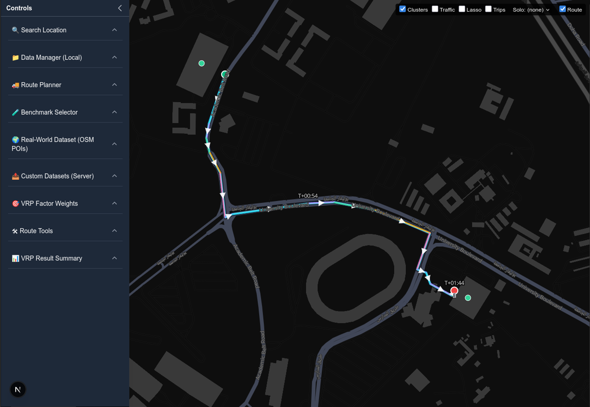

[](https://github.com/ai4smlab/Multi-Vehicle-Routing/blob/main/LICENSE)


# Multi-Vehicle-Routing Engine

A full-stack playground for **Vehicle Routing Problems (VRP)**.
It includes a **Next.js** frontend for map-based experimentation and a **FastAPI** backend with modular distance-matrix adapters and multiple solvers (**OR-Tools**, **Pyomo**, **VROOM**) plus benchmark loaders and emissions enrichment.

</a>

---

## Highlights

* ✨ **Multiple solvers**: OR-Tools (TSP/CVRP/VRPTW/PDPTW), Pyomo (CVRPTW via CBC), VROOM (coord/index; NN fallback), and a Mapbox Optimizer proxy.
* 🧭 **Distance-matrix adapters**: `haversine` (offline), `openrouteservice` (online; optional key), and a **local `euclidean` (planar XY)** for benchmark/planar datasets.
* 🗺️ **Frontend**: Waypoint editing, fleet configuration, benchmarking, ETA overlays, traffic gradient, animated trips, clustering, lasso/BBox selection.
* 🧩 **Datasets**: Solomon TXT, VRP-Set-XML100 (VRPLIB), CSV/GeoJSON helpers.
* 🧪 **Testing**: `pytest` for backend; `vitest`/`playwright` for frontend.
* 🧱 **Modular**: Clean registries for adapters & solvers; easy to extend.

---

## Repository Layout

```text
.
├── backend/                 # FastAPI service (VRP core)
│   ├── api/                 # Routers: /distance-matrix, /solver, /benchmarks, ...
│   ├── core/                # plugin loading, registries, logic
│   ├── services/            # adapters & solvers + metrics
│   ├── models/              # Pydantic schemas
│   ├── data/                # (optional) datasets root
│   └── doc/                 # backend docs / dev notes
├── frontend/                # Next.js application (map UI)
│   ├── src/                 # components, hooks, utils, pages/routes
│   └── public/              # static assets
├── docs/                    # reports, appendices, diagrams (recommended)
│   └── REPORT.md            # main report; see Appendix A — Task Log (at end)
├── tests/                   # cross-cutting E2E or shared fixtures (optional)
└── README.md                # ← you are here
```

> **Academic note:** Place your report at `docs/REPORT.md`. Put **“Appendix A — Task Log”** **at the very end** of that file, and reference it once in the body (e.g., at the end of “Detailed Tasks”).

---

## Quickstart (Local Dev)

### Prerequisites

* **Python 3.10+**
* **Node 18+** (or newer) with **npm** or **pnpm**
* (Optional) **Docker** for containerized runs
* Map token (optional): `NEXT_PUBLIC_MAPBOX_TOKEN` (frontend)
* ORS key (optional): `ORS_API_KEY` (backend OpenRouteService adapter)

### 1) Backend (FastAPI)

```bash
cd backend
python -m venv .venv && source .venv/bin/activate   # Windows: .venv\Scripts\activate
pip install -r requirements.txt

# optional, if you use the ORS adapter:
export ORS_API_KEY="your-ors-key"

uvicorn main:app --reload            # http://127.0.0.1:8000/docs
```

### 2) Frontend (Next.js)

```bash
cd frontend
npm i
# If the API runs on a different host/port:
echo "NEXT_PUBLIC_API_BASE=http://127.0.0.1:8000" >> .env.local
# Optional maps:
echo "NEXT_PUBLIC_MAPBOX_TOKEN=..." >> .env.local

npm run dev                          # http://127.0.0.1:3000
```

> The frontend reads `NEXT_PUBLIC_API_BASE` (default `/` if proxied).

---

## Configuration

### Backend env

* `DATA_DIR` — datasets root (default: `./backend/data`)
* `ORS_API_KEY` — OpenRouteService adapter access (optional)
* `GOOGLE_MAPS_API_KEY` — only if a Google adapter is enabled (optional)

### Frontend env

* `NEXT_PUBLIC_API_BASE` — base URL for the backend (e.g., `http://127.0.0.1:8000`)
* `NEXT_PUBLIC_MAPBOX_TOKEN` — Mapbox token for map/optimizer routing (optional but recommended)

---

## Benchmarks & Datasets

* **Benchmarks**: Load **Solomon** or **VRPLIB XML100** via the UI **Benchmark Selector** (frontend) or backend `/benchmarks/*` endpoints.

  * Planar datasets (e.g., Solomon XY) can use **Adapter: “euclidean (local)”** to avoid network-distance bias.
* **Custom datasets**: Upload CSV/GeoJSON/Solomon TXT via the UI **Custom Datasets** panel or backend `/files/*` endpoints.

---

## Dev Scripts (suggested)

Add a simple helper at repo root (optional) using `make`:

```makefile
dev:
\t( cd backend && . .venv/bin/activate 2>/dev/null || true && uvicorn main:app --reload ) & \\\n\t( cd frontend && npm run dev )

test:
\t( cd backend && pytest -q ) && ( cd frontend && npm run test )

build:
\t( cd frontend && npm run build )
```

---

## Testing

**Backend**

```bash
cd backend
pytest -q
```

**Frontend**

```bash
cd frontend
npm run test
# e2e (optional):
npm run test:e2e
```

---

## Troubleshooting

* **OR-Tools** `ROUTING_INVALID / status=4`

  * Ensure the **distance matrix is square**, diagonal zeros, and **durations** are present for TW models.
  * For Solomon-style inputs, normalize units (meters/seconds internally) and **prefer “euclidean (local)”** for planar XY.
  * Verify **depot index**, **non-negative demands**, and **vehicle capacities** (≥ total demand or large safe default).
* **VROOM** “Inconsistent delivery length … fallback NN used”

  * `demand` must be **number\[]**; `time_window` must be **{start,end} (seconds)**, not arrays.
* **Geometry doesn’t match**

  * Choose a geometry source in **Route Tools** (`auto/backend/mapbox/osrm/none`). The UI prefers persisted `displayCoords`.

---

## Roadmap (selected)

* Unified Search bar (dual geocoders, fwd/rev) with “add waypoint”.
* Data Manager: multi-format import (auto-detect), de-dupe, tagging, export.
* VRP Factors: auto-balance & presets, complexity/region detectors, auto-suggest.
* Real-world datasets: place + bbox harvesting; save/export.
* Gap analysis & benchmark comparison UX polish.

See **Issues** for the living plan.

---

## Contributing

See **[backend/doc/contributing.md](backend/doc/contributing.md)** for style and PR guidelines.

---

## 🔖 Citation

To cite this engine in publications, please use:

BibTeX:
```
@article{vrp_engine_v1.0,
  title   = {Multi-Vehicle Routing Engine},
  author  = {Ahmed Khalil Alosif and Alaa Khamis},
  organization = {AI for Smart Mobility Lab, IRC for Smart Mobility and Logistics at KFUPM},
  year    = {2025},
  note = {\url{https://github.com/ai4smlab/Multi-Vehicle-Routing}}
}
```

---

## 🙏 Acknowledgment  

We acknowledge the support of the **Interdisciplinary Research Center for Smart Mobility and Logistics at KFUPM** under Grant **SmartDispatch: AI-driven Optimization for Eco-Efficient Last-Mile Delivery**.  