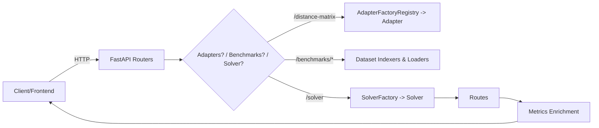
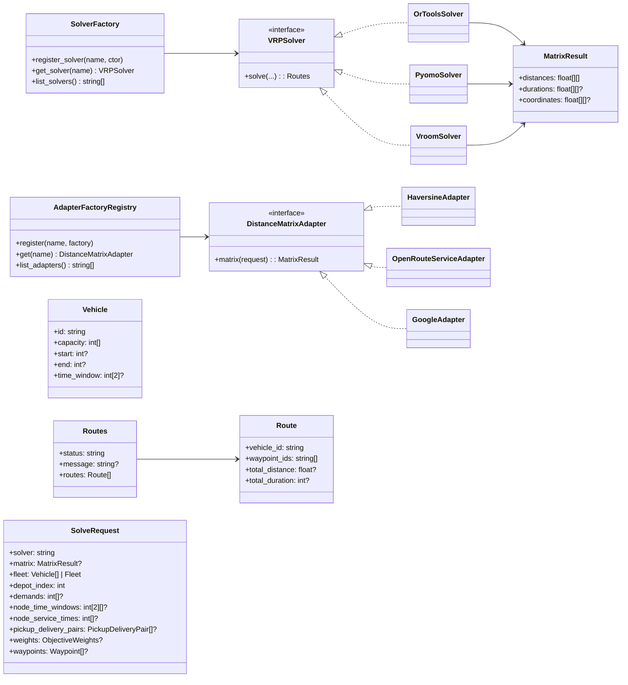

# Architecture & UML

This backend is a modular FastAPI service for VRP (Vehicle Routing Problem) experimentation.

## Module Map (Key Packages)

- `api/` — REST routes (adapters, solver, datasets, files, emissions, status)
- `core/` — interfaces, registries, plugin loading
- `services/` — concrete solvers & adapters, utilities
- `file_handler/` — benchmark indexers & format loaders
- `models/` — pydantic models (matrix, fleet, waypoints, solver payloads)

## Class Diagram (Core Types)

